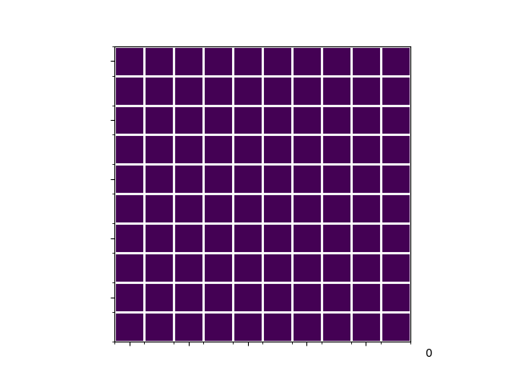

A reinforcement study of the game 1010!
===================

This project contains our study of reinforcement learning applied to the puzzle game 1010!. That includes:
* Our implementation of the environment (compatible with an AIGYM agent)
* A pre-trained agent, trained with the reference parameters described in our report
* Files to train an agent with the parameters you pick and see how it performs

Demo
------------
Below is a gif demo of a 1010! game played by our trained network. The number in the bottom-right corner indicates the score according to the original game's rules.


Installation
------------

To operate the project, you need to install the required modules :
```bash
pip install -r requirements.txt
pip install -e gym-tenten
```

How to use 
----------
This project runs with python 3.8.

### Play a party ###
* You can play a single game with a pre-trained model of your choice. One trained model is already available in the trained_model folder. Specify the model you want to use (our trained model in the example below) and how you want to name the gif it will generate. This gif will show the game played, including your score as in the *Demo*. Run: 
```bash
python play.py results/trained_model/model.pth gif_name
```
* You can play 50 games in a row with a pre-trained model of your choice. This will also compute some statistics on the games played (average score, best score) and will create a gif of the game with the best score, naming it best_game_\[corresponding score\]
```bash
python eval.py results/trained_model/model.pth
```

### Train a model ###
You can train a model choosing your own parameters (learning rate, epsilon decay...). This will register the model you trained in results/\[name_of_your_session]/model.pth. To do so use:
```bash
python train.py [options] SESSION_NAME

positional arguments:
  NAME                  Name of the session

optional arguments:
  -h, --help            show this help message and exit
  -n GRID_SIZE          Grid size
  -b BATCH_SIZE, --batch-size BATCH_SIZE
                        Batch size for replay memory
  -m AVAIL_BLOCKS       Number of available blocks
  --lr LR               Learning Rate
  -g GAMMA, --gamma GAMMA
                        Gamma in Bellman's equation
  --eps-start EPS_I     Initial epsilon for greedy policy
  --eps-end EPS_E       Final epsilon for greedy policy
  --decay-epi EPS_DECAY
                        Number of episodes for epsilon decay
  -e EPISODES, --episodes EPISODES
                        Number of episodes
  -u UPDATE, --update UPDATE
                        Update rate of the target network (in episodes)
  --loss LOSS           Loss function: L1 or L2 [default: L1]
  --desc DESC           Description of the session
  -v, --verbose         Set verbose mode on blablablabla
  --resume MODEL        Load a checkpoint to resume training
```
