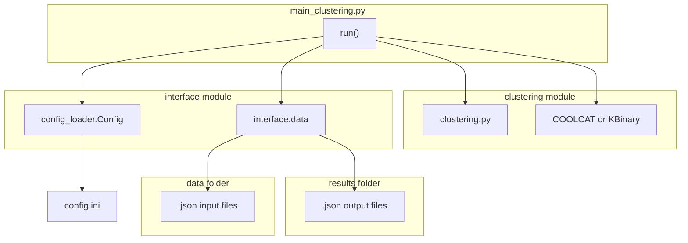
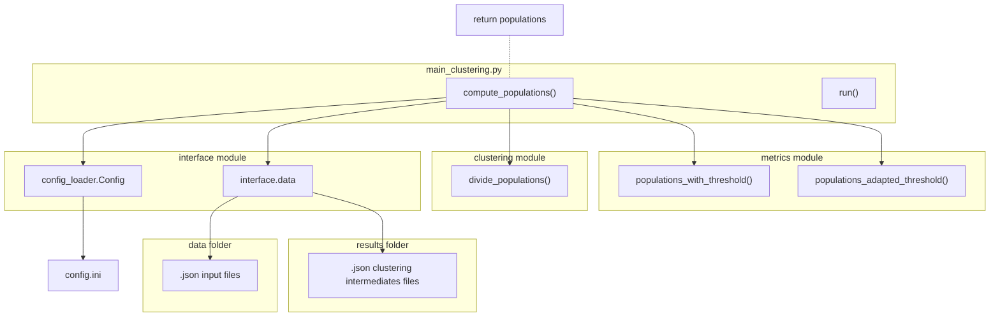

A reinforcement study of the game 1010!
===================

This project gathers together our study of reinforcement learning applied to the puzzle game 1010!. This includes:
* Our implementation of the environment
* 

Installation
------------

To operate the project, you need to install the required modules :
```bash
pip3 install -r requirements.txt
```

How to use (quick start)
----------

This project runs with python3.

- To compute and save a clustering of 100 clusters, on the current dataset:

```python
import main_clustering as clustering
clustering.run(100)
```
or with the command line interface :
```bash
python3 main_cli.py run --nb_clusters 100 
```

- To compute several clustering, use `run_several`. For example:
```python
clustering.run_several(3, 50, 10, scale='log')
```
or :
```bash
python3 main_cli.py run-several --n_min 3 --n_max 50 --n_runs 10 --scale log
```
computes 10 clusterings on the current dataset with numbers of clusters from 3 to 50 on a logarithmic scale.

- To display clustering results with matplotlib, use `show`. For example:
```python
clustering.show(3)
```
or
```bash
python3 main_cli.py show --nb_clusters 3
```


## The clustering module

The clustering functionality allows to divide a set of students into a defined number of groups (clusters) who share similar choices of courses.

### Code structure




### The `students` structure
In the whole repository, the variable or function argument `student` always refers to a dictionary with student ids as keys and dictionaries of student properties as values. These properties can include the fields `'subject_list'`, `'label'` (id of a cluster), `'career'`,  `'plan'`,  `'level'`,  and/or `'connected_component'`.

## Choosing the subscriptions to take into account
I implemented different ways of using a clustering result to automatically choose the subscriptions that will be taken into account for resolving the timetable problem :
- using a defined minimal proportion of student that allows a course to be taken into account : `populations_with_threshold()`
- using automatically adjusting minimal proportion of student, using a parameter `base_nb_constraints` : `populations_adapted_threshold()`
- subdividing a cluster and choosing courses into each subdivision in order to try to minimize a cost function : `divide_populations()`




## Measuring the results
We use three different measuring method in order to have an idea of the quality of the populations created by the function `compute_populations()` :
- the **subscription metric** : the proportion of subscriptions taken into account
- the **student metric** : the proportion of student whose subscriptions are all taken into account
- the **number of constraints**: the number of pairs of subjects that has to be compatibles.
These measurements are returned by the function `pop_info()`, in the module `metrics.metrics`.

## Visualizing the results
I implemented an interface to visualize each cluster of a clustering and see the effect of the functions `populations_adapted_threshold()` and `divide_populations()` on them. It can be launched with the function `display_pops()`, in the `metrics.metrics` module.

This interface was first designed to help me check the efficiency of the new functionnalities I develop and is not very user friendely, nor has a clean code. Currently, the easiest way to lauch it is as follows :
```python
populations_adapted_thresholds(students, base_nb_constraints, show_app=True):
```

## Possible improvements and missing functionalities

### Handling input and output file
Currently, the data sets we use are quite static and restrictive. Indeed, to operate, the modules assume that they will find certain files in certain folders. These files and folders are modifiable through the `config.ini` file, but can't be directly passed as a clustering function argument or a command line option.

I think that the most simple way to solve this problem is to modify the `Config` class in the `interface/config_loader.ini` file. A possible solution would be to allow an action such as `Config.set_dataset(enrollments_file, subjects_file)`, that permit the following calls to `Config.get('ENROLLMENT_FILE')` or `Config.get('SUBJECT_FILE')` to return the wanted files. This solution would minimize the required modifications in other python files but it's not necessarily the most natural way to do it.

### Used data structure
The data structure we use in input and output json files could be smarter and more human readable. David and Johnny designed a structure we didn't had the time to apply, but it can be done quite easily by modifying the functions of the `interface.data` module :
- `read_students()` for the students file,
- `read_subjects()` for the subjects file.
- `save_labels()` and `read_labels()` for the clustering results files.

### Command Line Interface
The command line interface I implemented allows to use a few functionalities of clustering. However, the `to_command()` function in the module `interface.cli` can be reused (and enhanced) in order to create rapidly new commands from already existing python functions. See its description for more details.

### Tests
I didn't implement any test module for the different functionalities of the project, except some doctests in the `utils/utils.py` file. This could be a good idea to do it, as the functionalities are now better defined than at the middle of the internship.
Moreover, I designed a simple testing data set that allowed me to make some tests by hand. I included it in the `config.ini` and `interface/config_loader.py` files. I think this data set could easily be used in automatic tests.

### VIKTOR-adapted populations
Currently, in the project,  `Population` refers to a namedtuple (defined in `utils/utils.py`)  that contains a list of students and a list of subjects. This indirectly contains the subscriptions we want to take into account in VIKTOR algorithm, but it needs an other process to get the data structure required in VIKTOR inputs.

### General code organization
We made some choices in your implementation that could have been (a lot) smarter but that are quite difficult to change, now. For example, the `students` variable, that always refers to the same structure of dictionary, would have probably been more easy to use and to understand it had been replaced by a object.
Moreover, there are several files that we stopped or nearly stopped using, during the last part of the internship. Functions are often documented and I don't know if some of them could be useful for the future. Maybe the best would be to re-implement them if needed. These files are :
- `clustering/kmodes/...`
- `clustering/POPC.py`
- `clustering/preprocessing.py`
- `interface/csv_handeling.py`
- `visualization/display_metrics.py`
- `visualization/display_results_inter.py`
- `visualization/raw_report.py`


References
----------

For the clustering algorithm, we used the COOLCAT algorithm, described in the article _COOLCAT: An entropy-based algorithm for categorical
clustering_ (Barbará, Couto, Li)
